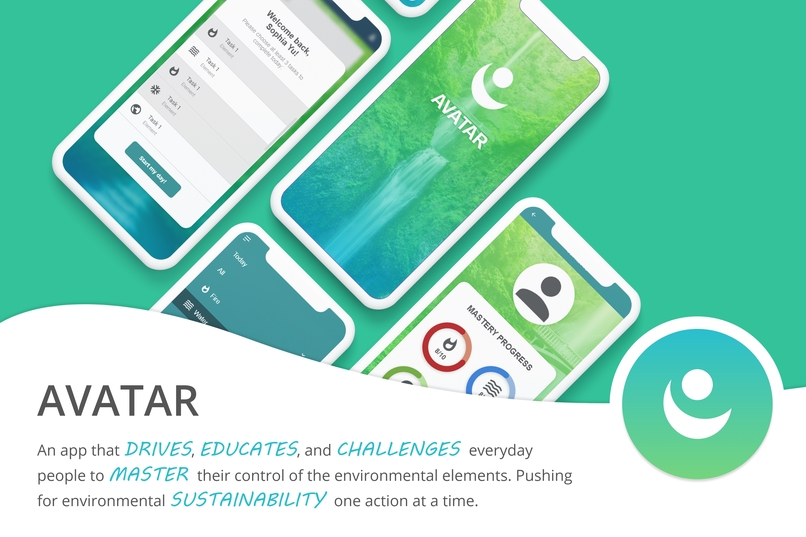

# **Sophia Yu**

**[About Me](#about-me) | [Software Engineering](#software-engineering) | [Contact Info and Links](#contact-info-and-links)**

## **About Me**
> I am a 2<sup>nd</sup> year student majoring in Computer Science and minoring in ~~ICAM~~ Business. Following are some of my hobbies:
* running
* baking + cooking ([link to my fav food 😋](food.md))
* playing basketball
* golfing
* dancing
* drawing
  
```
👟 fun fact: I'm training for a half marathon right now
```
## **Software Engineering**
> I have two years of work experience and 6+ years of programming experience in total.

Here is a list of all the languages I have been exposed to:
1. **Java:** 6+ years; achieved Oracle Certified Associate, SE 8 Programmer
2. **C++:** 2 years; learned in college; main language used in courses
3. **HTML/CSS:** 2+ years; started learning in high school
4. **Linux:** 4+ years; frequently used in terminal
5. **Python:** less than a year; learned a bit in high school and picking it up again
6. **ARM:** less than a year; learned for a course in college

CS can be applied to so many fields, and there's a lot of jobs that I want to explore. Below are some that I have or want to experience:

- [x] Software Developer
- [ ] Web Developer
- [ ] UX Designer
- [x] Mobile App Developer
- [ ] Project Manager
- [ ] AI Engineer
- [ ] Video Game Developer

## **Contact Info and Links**
*Feel free to contact me or check out some of my projects below:*

**Personal Info:** soy001@ucsd.edu | [LinkedIn](https://www.linkedin.com/in/syu125/) | [Github](https://github.com/Syu125)

**Projects:** 
> [Project Avatar](https://devpost.com/software/avatar-52ekr4)
> 

Below is a snippet of the code: (feel free to check out the entire project [here](https://github.com/Syu125/Avatar))
```
package com.gmail.avatar;

import android.widget.CheckedTextView;
import android.widget.LinearLayout;

public class Task {
    CheckedTextView ctv;
    String task;
    LinearLayout linearLayout;
    public Task(String task){
        this.task = task;
    }
    public String getTaskName(){
        return task;
    }
}
```

> [Photoshop Portfolio](https://yusophia.weebly.com/photoshop.html)

> [Graphic Design Portfolio](https://yusophia.weebly.com/illustrator.html)

